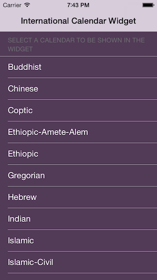

# International Calander Widget
Helps you find out which day is today in all Calendars, and it's also localized to current locale of the device you're using on it.
This Widget is demonstartion for sending data between an App, and an Extension (Widget) using NSUserDefaults using groups.

 

### License
International Calendar Widget is under MIT Licence. Check the license file for more information.

### Contact Info
follow me on twitter: [@jamal_2](https:///www.twitter.com/jamal_2)
